# AI Test Case Generator Platform — Software Architecture & Implementation Status Diagram

> [!IMPORTANT]
> **CURRENT IMPLEMENTATION POSITION HIGHLIGHTS:**  
> - **`CORE AUTOMATION GENERATION ENGINE — COMPLETED`** (10 / 10 Framework-Language routes verified and passed)
> - **`FASTAPI END-TO-END INTEGRATION — COMPLETED`** (Stage 15 - All 12/12 endpoint routes validated with 100% pass rate)

---

## 1. System Architecture Flow Diagram

Below is the complete enterprise architecture flow for the **AI Test Case Generator Platform**, depicting the directional flow from Frontend to FastAPI, through the Automation Service orchestration, the 3 parallel components, Locator Resolver, Framework-Independent Plan, Generator Dispatcher, Framework Generators, sandboxed Execution, Reporting, and AI Self-Healing.

```mermaid
flowchart TD
    classDef completed fill:#064e3b,stroke:#10b981,stroke-width:2px,color:#ecfdf5;
    classDef inprogress fill:#78350f,stroke:#f59e0b,stroke-width:2px,color:#fffbeb;
    classDef nexttask fill:#1e3a8a,stroke:#3b82f6,stroke-width:2px,color:#eff6ff;
    classDef future fill:#312e81,stroke:#8b5cf6,stroke-width:2px,color:#f5f3ff;
    classDef highlight fill:#831843,stroke:#ec4899,stroke-width:2px,color:#fdf2f8;

    subgraph FRONTEND ["FRONTEND USER INTERFACE [COMPLETED]"]
        FE1["Test Case Input"]
        FE2["Framework Selection"]
        FE3["Language Selection"]
        FE4["Generate Automation Controls"]
    end
    class FRONTEND completed;

    FRONTEND -->|HTTP / JSON Payload| FASTAPI

    subgraph FASTAPI ["FASTAPI BACKEND SERVICE [COMPLETED]"]
        API1["API Layer (/generate-automation)"]
        API2["Authentication & Session"]
        API3["Request/Response Handling & Async Worker Threading"]
    end
    class FASTAPI completed;

    FASTAPI -->|Validated Request| AUTO_SERVICE

    subgraph AUTO_SERVICE ["AUTOMATION SERVICE [COMPLETED]"]
        ORCH["Main Workflow Orchestrator"]
        
        subgraph PARALLEL ["3 PARALLEL WORKFLOW COMPONENTS [COMPLETED]"]
            P1["1. TEST CASE NORMALIZATION\nConvert to standard internal format"]
            P2["2. AI / AUTOMATION PLANNER\nConvert steps to structured actions & assertions"]
            P3["3. APPLICATION CONTEXT\nInspect live UI, extract DOM evidence"]
        end
    end
    class AUTO_SERVICE completed;
    class PARALLEL completed;

    P1 --> LOC_RES
    P2 --> LOC_RES
    P3 --> LOC_RES

    subgraph LOC_RES ["LOCATOR RESOLVER [COMPLETED]"]
        LR1["Resolve business targets to real UI locators"]
        LR2["Multi-strategy ranking: Role, Placeholder, Name, CSS, XPath"]
        LR3["Confidence scoring & candidate locators"]
    end
    class LOC_RES completed;

    LOC_RES --> RESOLVED_PLAN

    subgraph RESOLVED_PLAN ["RESOLVED AUTOMATION PLAN [COMPLETED]"]
        IR1["Framework-Independent Representation"]
        IR2["Structured Actions & Assertions"]
        IR3["Resolved UI Locators & Fallbacks"]
    end
    class RESOLVED_PLAN highlight;

    RESOLVED_PLAN --> DISPATCHER

    subgraph DISPATCHER ["GENERATOR DISPATCHER [COMPLETED - 10/10 PASSED]"]
        GD1["Central Routing Component"]
        GD2["Validate Framework + Language Combinations"]
        GD3["Dispatch to Targeted Code Generator"]
    end
    class DISPATCHER completed;

    DISPATCHER --> SELENIUM
    DISPATCHER --> PLAYWRIGHT
    DISPATCHER --> APPIUM
    DISPATCHER --> CYPRESS
    DISPATCHER --> FUTURE_FW

    subgraph GENERATORS ["FRAMEWORK-SPECIFIC GENERATORS [COMPLETED]"]
        subgraph SELENIUM ["SELENIUM GENERATORS"]
            S_PY["Python"]
            S_JV["Java"]
            S_JS["JavaScript"]
        end

        subgraph PLAYWRIGHT ["PLAYWRIGHT GENERATORS"]
            PW_PY["Python"]
            PW_JV["Java"]
            PW_JS["JavaScript"]
        end

        subgraph APPIUM ["APPIUM GENERATORS"]
            AP_PY["Python"]
            AP_JV["Java"]
            AP_JS["JavaScript"]
            AP_OS["Android / iOS (UiAutomator2 / XCUITest)"]
        end

        subgraph CYPRESS ["CYPRESS GENERATOR"]
            CY_JS["JavaScript Only (Py/Java Rejected)"]
        end

        subgraph FUTURE_FW ["FUTURE FRAMEWORKS"]
            EXT["Extensible Architecture (Robot, WebdriverIO)"]
        end
    end
    class GENERATORS completed;
    class FUTURE_FW future;

    SELENIUM --> GEN_CODE
    PLAYWRIGHT --> GEN_CODE
    APPIUM --> GEN_CODE
    CYPRESS --> GEN_CODE

    subgraph GEN_CODE ["GENERATED AUTOMATION CODE [COMPLETED]"]
        GC1["Production-Ready Automation Script"]
    end
    class GEN_CODE completed;

    GEN_CODE --> EXEC_SERVICE

    subgraph EXEC_SERVICE ["EXECUTION SERVICE [FUTURE]"]
        EX1["Execute generated automation"]
        EX2["Manage sandboxed runtime environment"]
        EX3["Capture execution status & logs"]
    end
    class EXEC_SERVICE future;

    EXEC_SERVICE --> TEST_RESULTS

    subgraph TEST_RESULTS ["TEST RESULTS & LOGS [FUTURE]"]
        TR1["Pass / Fail Status"]
        TR2["Execution time & Console logs"]
        TR3["Error details & Failure Screenshots"]
    end
    class TEST_RESULTS future;

    TEST_RESULTS --> REPORTING

    subgraph REPORTING ["REPORTING DASHBOARD [FUTURE]"]
        RP1["Test execution reports"]
        RP2["Automation results & Historical trends"]
    end
    class REPORTING future;

    REPORTING --> SELF_HEALING

    subgraph SELF_HEALING ["AI / SELF-HEALING LOCATOR ENGINE [FUTURE]"]
        SH1["Detect locator failures"]
        SH2["Re-inspect application DOM"]
        SH3["Select candidate fallback locators"]
        SH4["Suggest / auto-update broken locators"]
    end
    class SELF_HEALING future;
```



---

## 2. Framework & Language Generator Routing Matrix

The **Generator Dispatcher** serves as the central routing engine, strictly validating and routing supported framework and programming language pairs:

| Automation Framework | Supported Language | Dispatcher Status | Generator Class / Module |
| :--- | :--- | :---: | :--- |
| **Selenium** | Python | `PASS` (100%) | `SeleniumPythonGenerator` |
| **Selenium** | Java | `PASS` (100%) | `SeleniumJavaGenerator` |
| **Selenium** | JavaScript | `PASS` (100%) | `SeleniumJavaScriptGenerator` |
| **Playwright** | Python | `PASS` (100%) | `PlaywrightPythonGenerator` |
| **Playwright** | Java | `PASS` (100%) | `PlaywrightJavaGenerator` |
| **Playwright** | JavaScript | `PASS` (100%) | `PlaywrightJavaScriptGenerator` |
| **Appium** | Python | `PASS` (100%) | `AppiumPythonGenerator` |
| **Appium** | Java | `PASS` (100%) | `AppiumJavaGenerator` |
| **Appium** | JavaScript | `PASS` (100%) | `AppiumJavaScriptGenerator` |
| **Cypress** | JavaScript | `PASS` (100%) | `CypressJavaScriptGenerator` |
| **Cypress** | Python | `REJECTED` (Expected) | *N/A (Framework limit)* |
| **Cypress** | Java | `REJECTED` (Expected) | *N/A (Framework limit)* |

---

## 3. Implementation Stage Breakdown & Status Tracking

```carousel
### Stage 1 - 6: Core Engine Foundation
- **Stage 1: Project Foundation** `[COMPLETED]` — Frontend & FastAPI backend structure established.
- **Stage 2: Test Case Generation** `[COMPLETED]` — Test Case normalization implemented.
- **Stage 3: Application Inspection** `[COMPLETED]` — Live target web app DOM inspector active via Playwright Sync API.
- **Stage 4: Locator Intelligence** `[COMPLETED]` — Business target matching using multi-strategy evidence.
- **Stage 5: Automation Planning** `[COMPLETED]` — Natural language steps converted to structured actions/assertions.
- **Stage 6: Automation Plan Resolution** `[COMPLETED]` — Framework-independent `ResolvedAutomationPlan` built.

<!-- slide -->

### Stage 7 - 15: Generators & API Integration
- **Stage 7: Selenium Generators** `[COMPLETED]` — Python, Java, JavaScript generators built.
- **Stage 8: Playwright Generators** `[COMPLETED]` — Python, Java, JavaScript generators built.
- **Stage 9: Appium Architecture** `[COMPLETED]` — Mobile UiAutomator2 (Android) & XCUITest (iOS) specs configured.
- **Stage 10: Appium Generators** `[COMPLETED]` — Python, Java, JavaScript mobile generators built.
- **Stage 11: Cypress Generator** `[COMPLETED]` — JavaScript generator built; Python & Java invalid pairs rejected.
- **Stage 12: Validation Rules** `[COMPLETED]` — Matrix validation rule engine created.
- **Stage 13: Generator Dispatcher** `[COMPLETED]` — Central router passed 10/10 integration tests.
- **Stage 14: Automation Service** `[COMPLETED]` — Pipeline orchestration complete; parser bug fixes applied.
- **Stage 15: FastAPI Integration** `[COMPLETED]` — `/generate-automation` endpoint validated across 12/12 API test routes with 100% pass rate.

<!-- slide -->

### Next Roadmap Tasks
- **Next Task 1: Frontend UI Integration** `[NEXT]` — Connect frontend UI controls to `/generate-automation`.
- **Next Task 2: Generated Code Preview** `[NEXT]` — Render syntax-highlighted code editor preview in UI.
- **Next Task 3: Code Download** `[NEXT]` — Export generated scripts as `.py`, `.js`, `.java` files.
- **Next Task 4: Automation Execution** `[NEXT]` — Subprocess script execution engine.
- **Future Stages 5 - 9: Sandbox Execution & AI Healing** `[FUTURE]` — Subprocess execution, reports, screenshots, and self-healing.
```

---

## 4. End-to-End Validation Results

> [!NOTE]
> **FastAPI `/generate-automation` Endpoint Validation Summary:**
> - **Total Routes Tested:** 12 (10 Supported Combinations + 2 Rejected Pairs)
> - **Passed:** 12 / 12 (100% Pass Rate)
> - **Failed:** 0
> - **Execution Script:** `backend/test_api_generate_automation.py`
